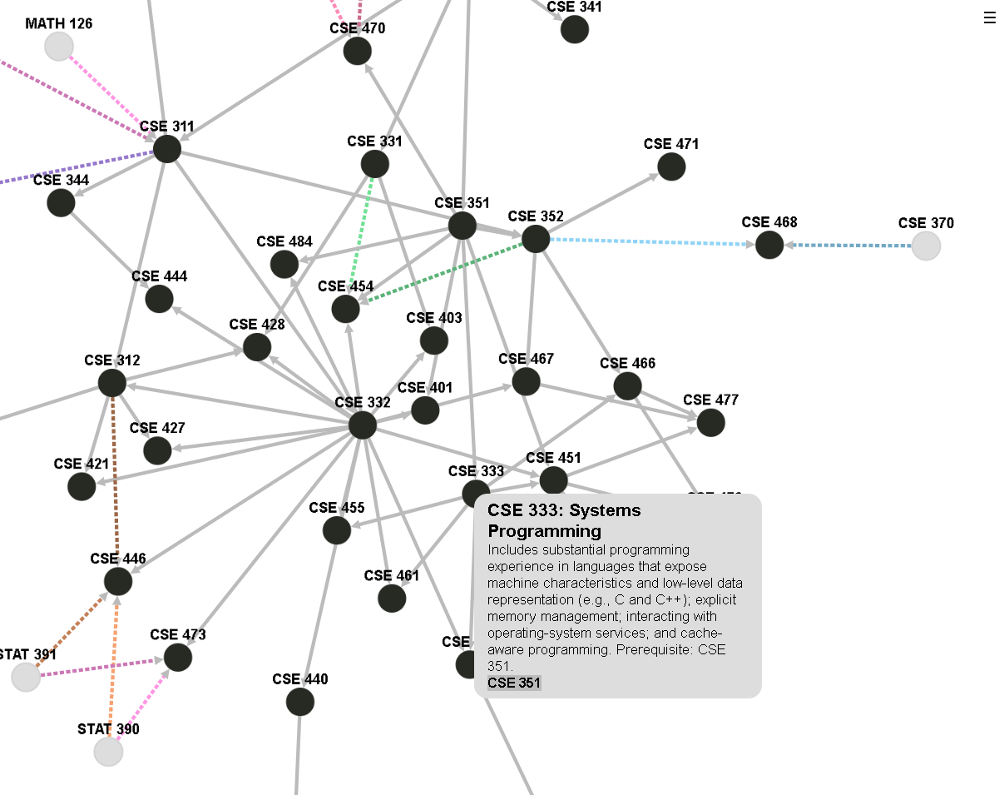

# Course Webifier

A course visualizer for CS courses.

## Dependencies

This website requires the following dependencies

 * cytoscape.js  (get it [here](https://github.com/cytoscape/cytoscape.js))
 * cytoscape-cose-bilkent.js  (get it [here](https://github.com/cytoscape/cytoscape.js-cose-bilkent))

They can be found on github

## Installation

This is a website and uses PHP, you should upload all the files, and the dependencies, to a server.

It is also viewable live [here](https://www.students.washington.edu/caseyws)

## Screenshot

